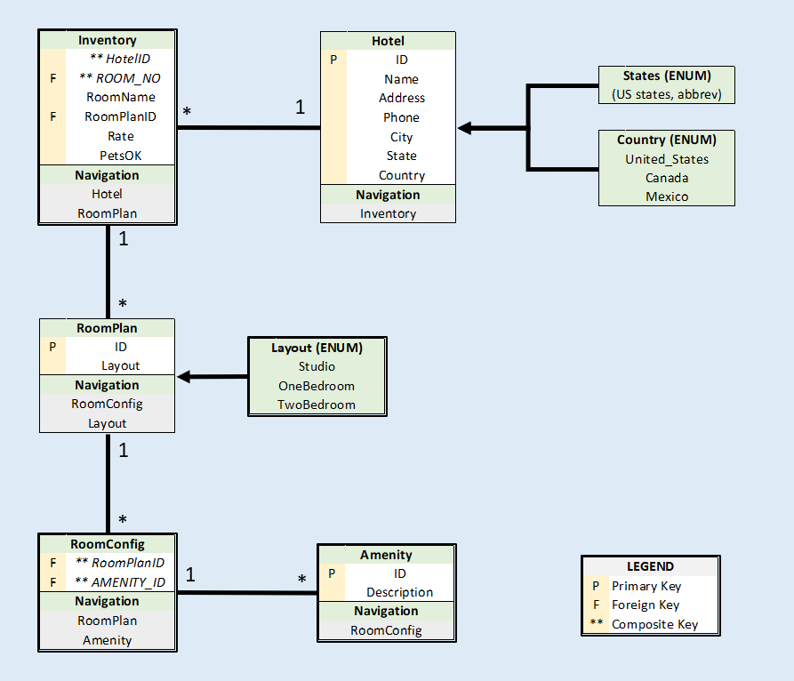

 Potentially unfamiliar terms link to informative sources
 Extensive API documentation
 Caveats and limitations mentioned up-front

# AsyncInn
This ASP.NET Core web application is a full-CRUD SQL Server based room 'inventory' management system for a fictional hotel chain. 

# Installation
1. Clone this repo.
2. Open /AsyncInn/AsyncInn/AsyncInn.csproj (in Visual Studio 2017 or later).
3. Build database:
   - Open NuGet Package Manager Console (Tools > NuGet Package Manager > Package Manager Console):
      PM> Add-Migration initial
   - Confirm DB build in SQL Object Explorer (look for 'AsyncInn')
4. Launch page by pressing green arrow in 'Standard' toolbar with 'IIS Express' selected.

# Architecture
MODEL

VIEWS

CONTROLLERS

# Database Schema

# Usage

# Credit
Logo graphics: https://www.freeiconspng.com/img/25314

# License
MIT License

Copyright (c) 2019 Gwendolyn Zubatch

Permission is hereby granted, free of charge, to any person obtaining a copy of this software and associated documentation files (the "Software"), to deal in the Software without restriction, including without limitation the rights to use, copy, modify, merge, publish, distribute, sublicense, and/or sell copies of the Software, and to permit persons to whom the Software is furnished to do so, subject to the following conditions:

The above copyright notice and this permission notice shall be included in all copies or substantial portions of the Software.

THE SOFTWARE IS PROVIDED "AS IS", WITHOUT WARRANTY OF ANY KIND, EXPRESS OR IMPLIED, INCLUDING BUT NOT LIMITED TO THE WARRANTIES OF MERCHANTABILITY, FITNESS FOR A PARTICULAR PURPOSE AND NONINFRINGEMENT. IN NO EVENT SHALL THE
AUTHORS OR COPYRIGHT HOLDERS BE LIABLE FOR ANY CLAIM, DAMAGES OR OTHER LIABILITY, WHETHER IN AN ACTION OF CONTRACT, TORT OR OTHERWISE, ARISING FROM, OUT OF OR IN CONNECTION WITH THE SOFTWARE OR THE USE OR OTHER DEALINGS IN THE
SOFTWARE.
